# Ecourse - Online Learning
> Ecourse help the students can learn everywhere, everytime on this website with Video lesson and Online exam.
> Live demo [_here_](https://www.ecourse.id.vn/). 

## Table of Contents
* [General Info](#general-information)
* [Technologies Used](#technologies-used)
* [Features](#features)
* [System work flow](#system-work-flow)
* [Screenshots](#screenshots)
* [Setup](#setup)
* [Usage](#usage)
* [Unit test](#unit-test)
* [Project Status](#project-status)
* [Contact](#contact)


## General Information
- On this web site, teacher can upload video lesson and create exam for student. After the student has taken the test, the score will be automatically graded. If average score of exam is greater than 7.5, student will have a certificate of this course. Student can export certificate to pdf for sharing anywhere.
- This website connects between students and teachers. Student will have a convenience learning method.


## Technologies Used
- Python - version 3.10.12
- Django - version 4.2.2
- Postgres- version 13.4 
- Redis - version 3.0.1
- Django REST Framework - version 3.14.0
- django-material-admin- verision 1.8.6
- xhtml2pdf - version 0.2.11
- django-webpush - version 0.3.5
- Pre-commit for python: black - version 23.3.0
- Pre-commit for Javascript: prettier - version 3.0.2
- Docker

## Features
List the ready features here:
- Learning with video lesson
- Get certificate and export to PDF file
- Automatically grade the test 
- Push notification on system bar.
- Learn progress overview

## System work flow
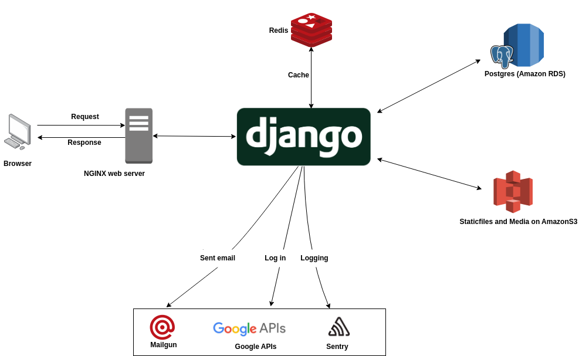

## Database
Database diagram link: [_here_]( https://www.mermaidchart.com/raw/2f76a97a-6dbc-4f46-a8ea-ad516bb257db?version=v0.1&theme=light&format=svg). 
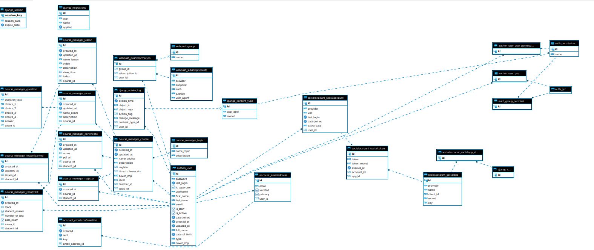

This diagram can be created on Mermaid with code in [db.txt](db.txt) file
## Screenshots
- Home page

- Course page
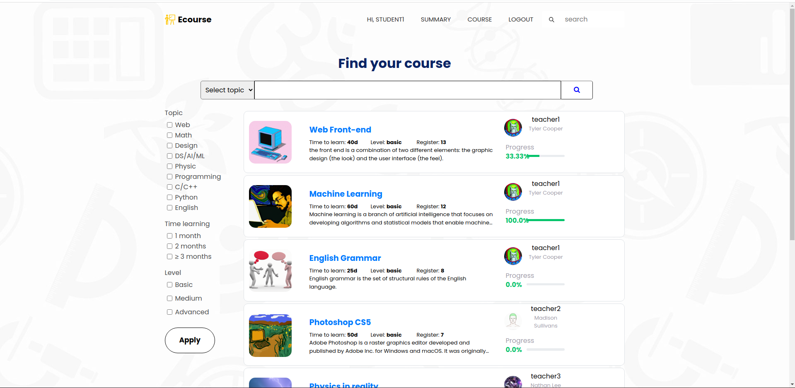
- Course detail
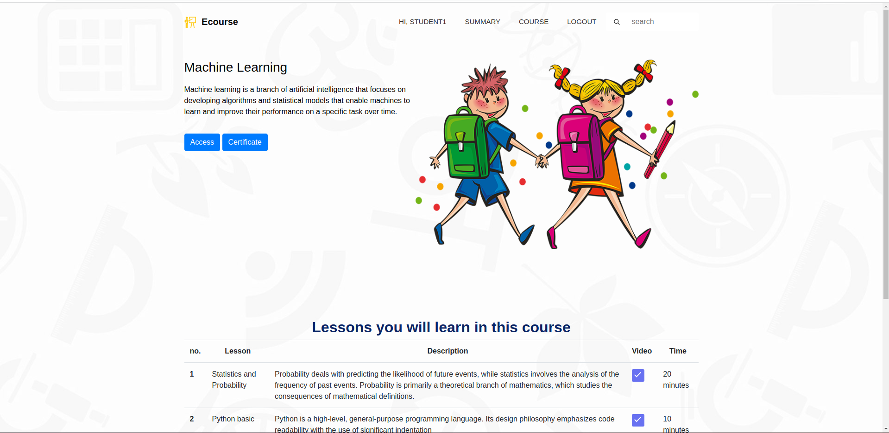
- Login
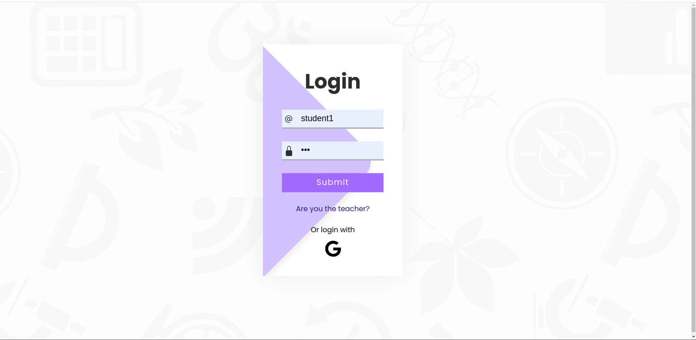
- Register
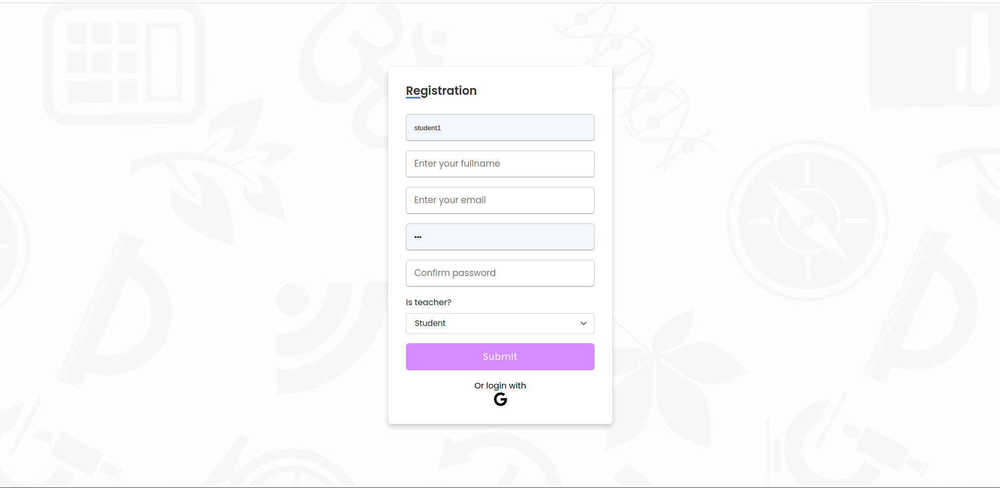
- Profile
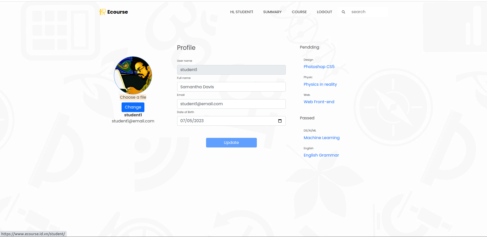
- Certificate
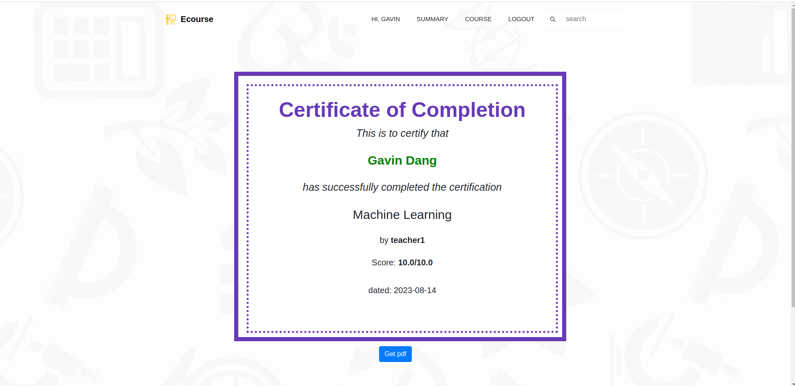
- Summary
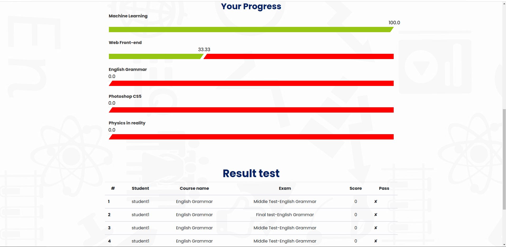
- Lesson
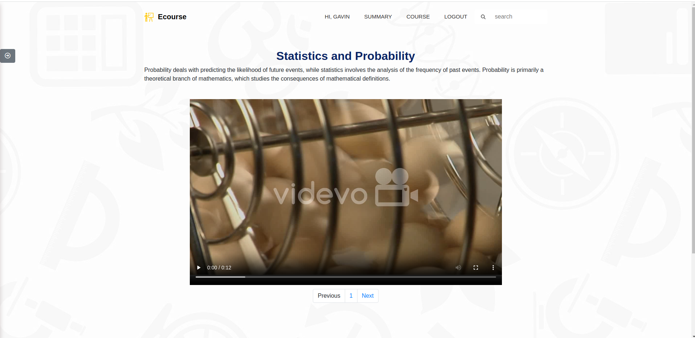
- Exam
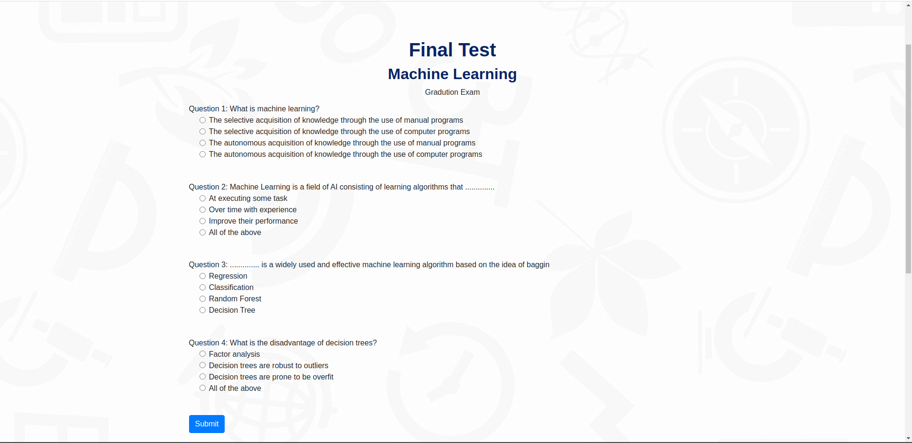
- Exam result
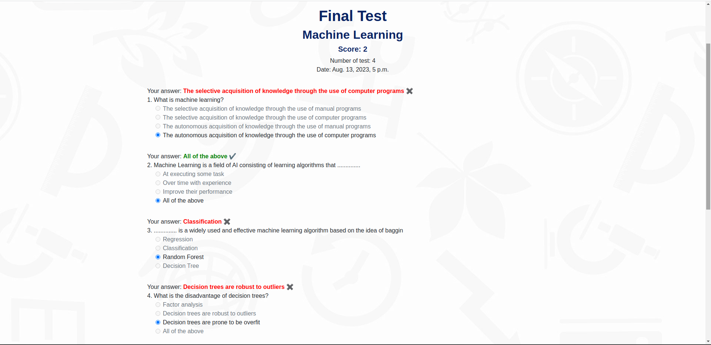
- Test result summary
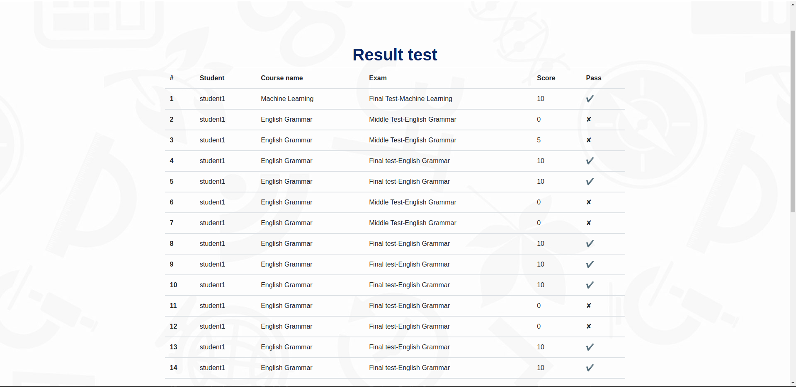
- Notification:

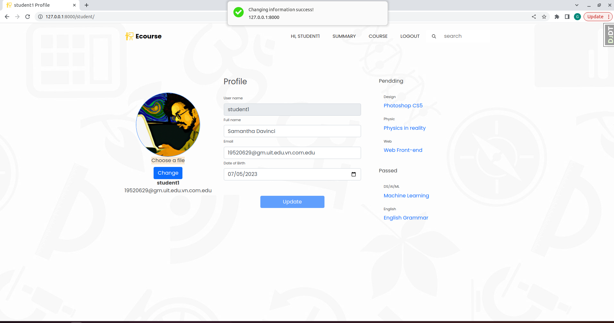

## Setup
### Runing Docker-Compose
1. Clone this repo
```
git clone https://github.com/gavin-go-dang/demo1_ECourse.git
```
2. Set up .env file at root project folder base on **example.env** file
```
SECRET_KEY="Update your key"
DB_NAME=postgres
DB_USER=gavindang
DB_PASSWORD=123
DB_HOST_STAGGING=db
DB_PORT=5432 

EMAIL_BACKEND="Update your email backend service"
MAILGUN_ACCESS_KEY="Update your key"
MAILGUN_SERVER_NAME="Update your key"
EMAIL_PORT=587

SENTRY_KEY_PRODUCTION=Update_your_key
SENTRY_KEY_STAGGING=Update_your_key
#Push notification
VAPID_PUBLIC_KEY="Update_your_key"
VAPID_PRIVATE_KEY="Update_your_key"
VAPID_ADMIN_EMAIL="Update_your_key"
 
AWS_ACCESS_KEY_ID=Update_your_key
AWS_SECRET_ACCESS_KEY=Update_your_key
AWS_STORAGE_BUCKET_NAME=Update_your_key
#Auth with Google Account
CLIENT_ID=Update_your_key
CLIENT_SECRET=Update_your_key
AUTH_APP=Update_your_key

EMAIL_HOST_USER=Update_your_key
EMAIL_HOST_PASSWORD=Update_your_key
MAILGUN_API_KEY=Update_your_key
MAILGUN_DOMAIN_NAME=Update_your_key
```

3. Configure the file  **manage.py**, make sure it points to the stagging environment

4. Run docker-compose
```
docker-compose up --build
```

5. Load sample data:
```
docker exec -it web bash
python3 manager.py loaddata sample_data.json
```

### Running without Docker-Compose
1. Clone this repo
1. Set up .env file
1. Configure the environment variables.
```
virtualenv env
source env/bin/activation
```

4. Configure the file  **manage.py**, make sure it points to the local environment
5. Install lib and package
```
pip install -r requirements.txt
```

6. Run the migrations
```
python3 manage.py migrate
```
7. Load data:
```
python3 manage.py loaddata data_sample.json
```
8. Runserver
```
python3 manage.py runserver
```

## Unit test
Unit test cover 85%

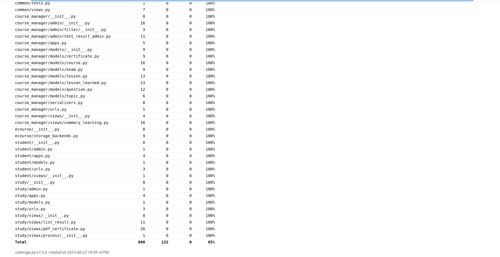

## Project Status
Project is: _in progress_ 


## Contact
Created by Gavin Dang - feel free to contact me!
Email: gavin.dang.goldenowl@gmail.com

